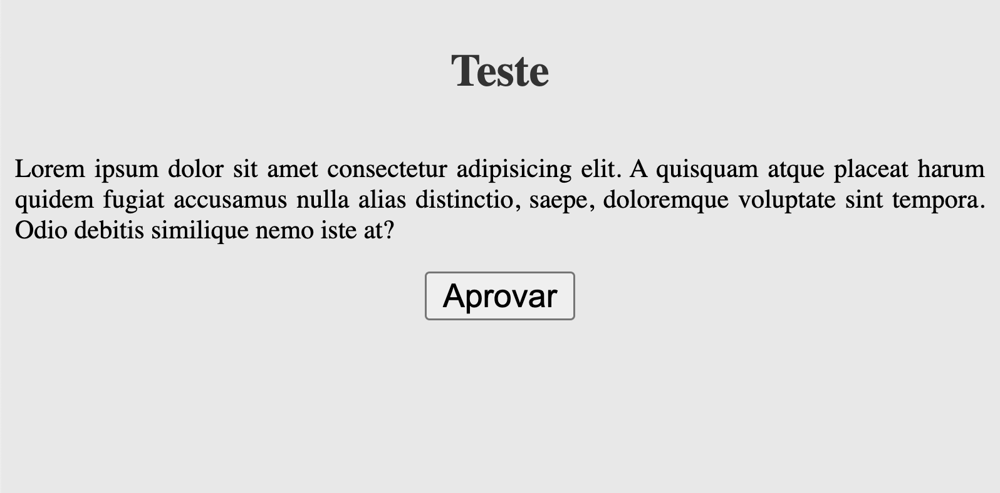

### Primeiros passos

Você esta dando seus primeiros passos com o desenvolvimento web. Nessa etapa, vamos praticar um pouco html e css.

Construa uma pagina com HTML e CSS tentando chegar o mais próximo possível da imagem disponibilizada: prototipo.png

Dica: `flex box` pode ajudar a centralizar as coisas.